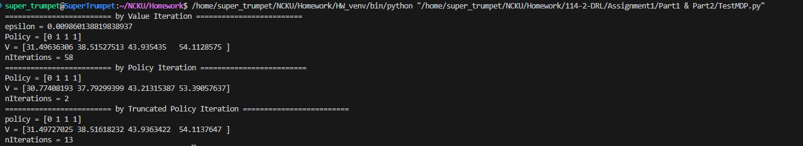

# Part1
* Policy、Value Function、no of iterations of the three algorithm (Value Iteration、Policy Iteration、Modified Policy Iteration):  
  
* Discussion 位在 `Assignment1/Part1 & Part2/Part1 Discussion.txt`。  

---     
# Part2  
* Q-Learning 使用四個不同 epsilon 的 cumulative discounted rewards 圖片位於 `Assignment1/Part1 & Part2/Avg_Cumulative_reward.png`。  
* Discussion 位在 `Assignment1/Part1 & Part2/Part2 Discussion.txt`。  

---  
# Part3  
* DQN 的 Target Network 使用不同步數進行同步所得的 Avg. Cumulative Reward 的圖片位在 `Assignment1/Part3/Avg_Cumulative_reward_last_25_episodes_sync_duration.png`。   
* Discussion 位在 `Assignment1/Part3/discussion.txt` 的第一個 Q & A。    
* DQN 使用不同 mini-batch size 所得的 Avg. Cumulative Reward 的圖片位在 `Assignment1/Part3/Avg_Cumulative_reward_last_25_episodes_minibatch_size.png`。  
* Discussion 位在 `Assignment1/Part3/discussion.txt` 的第二個 Q & A。  